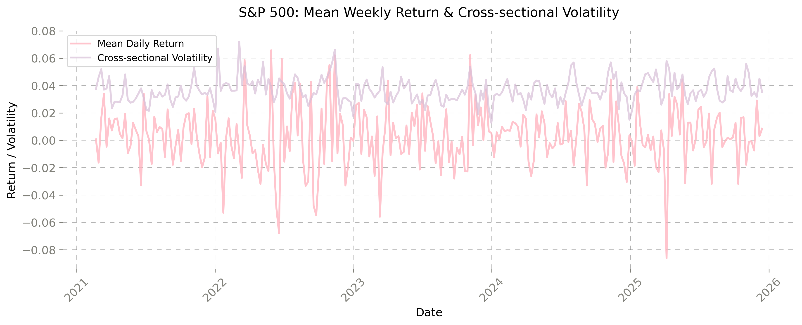
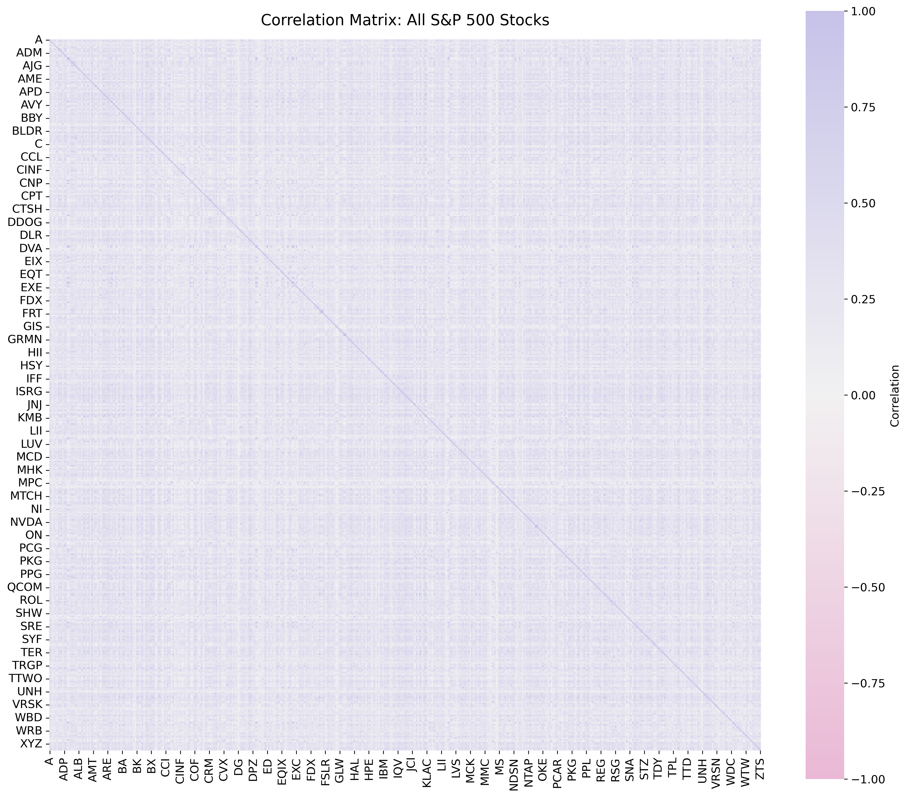
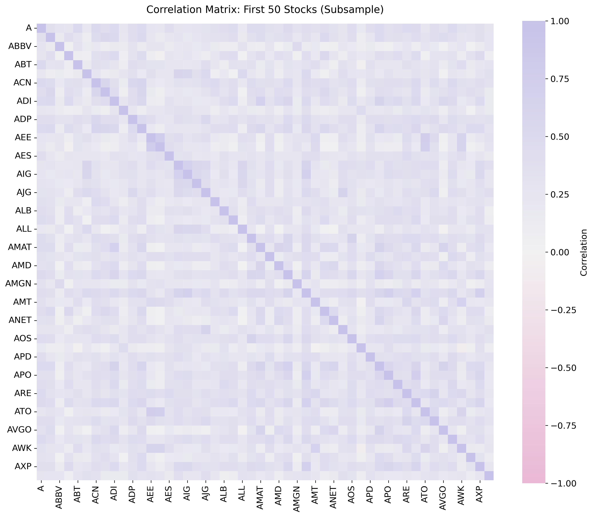
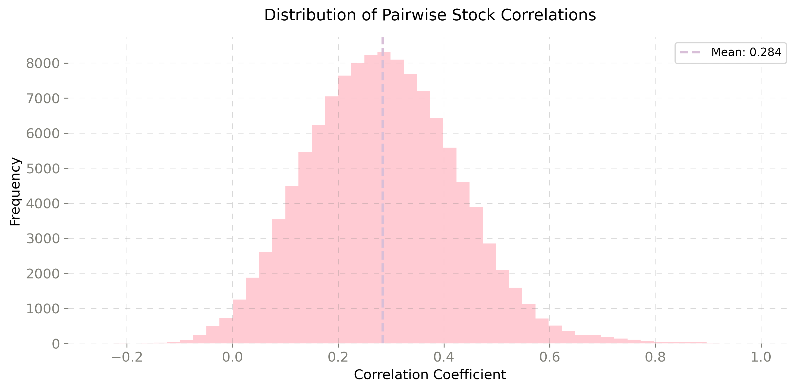
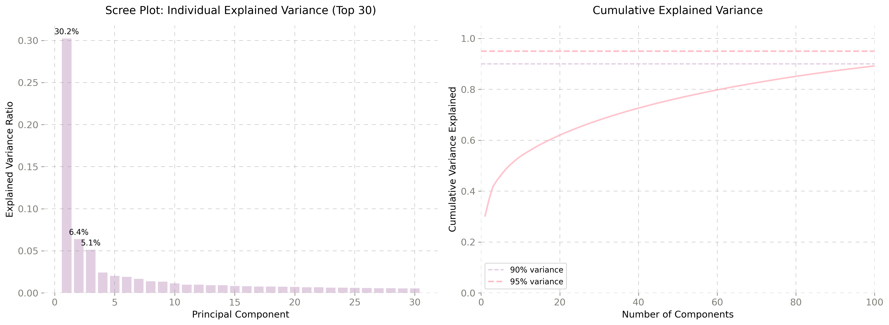
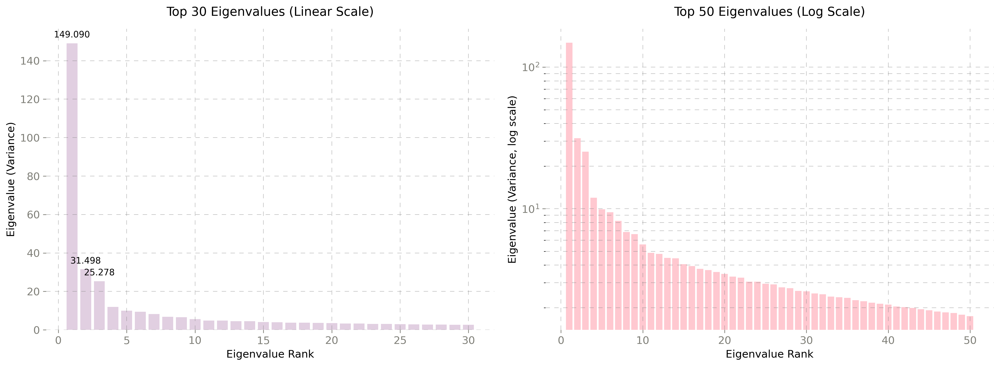
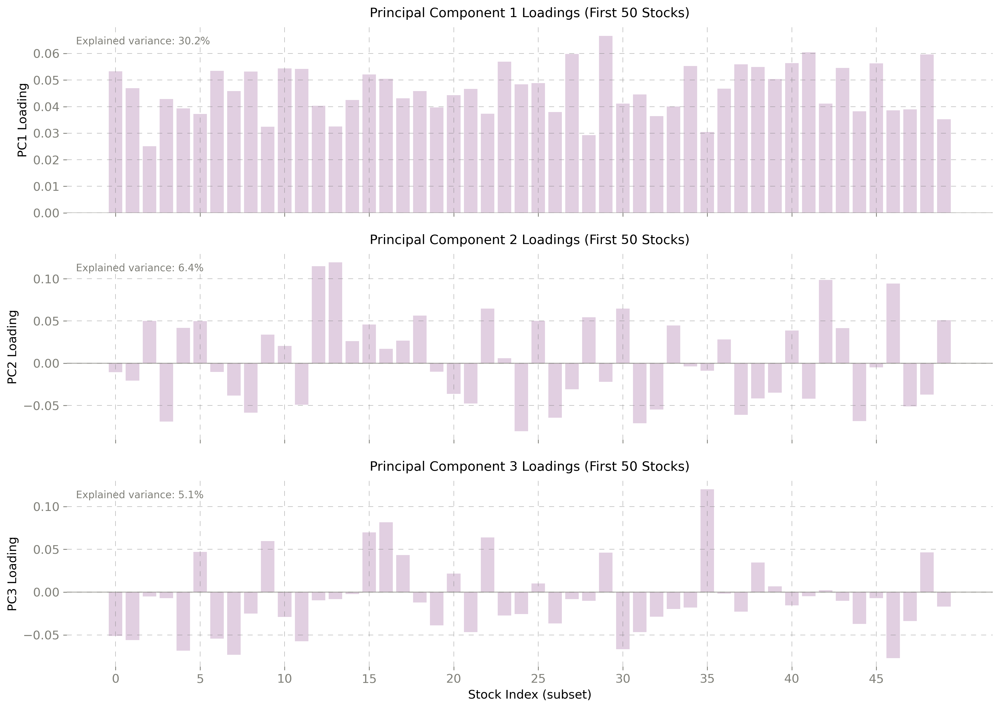
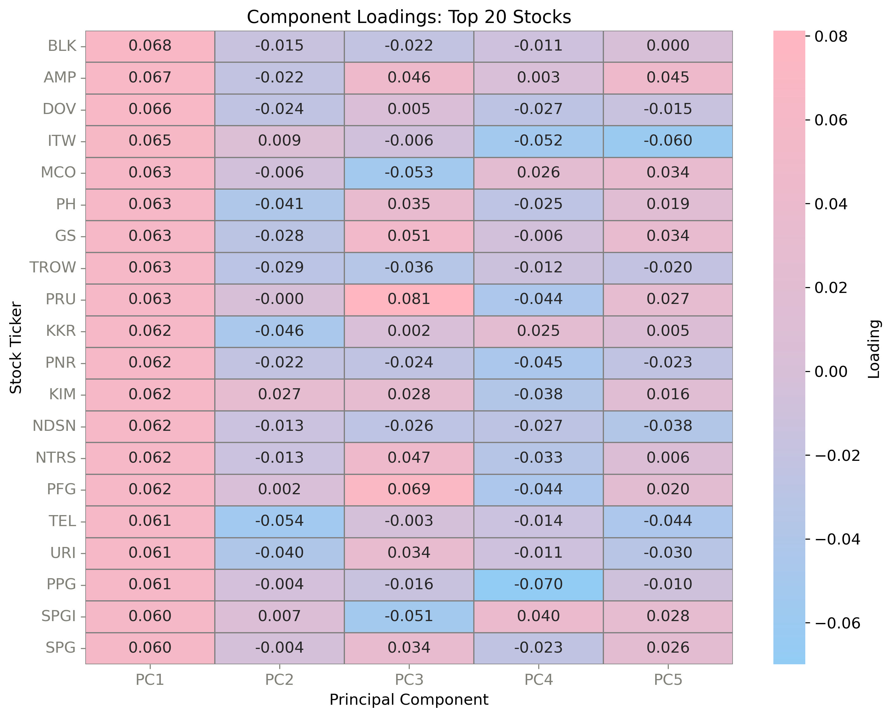
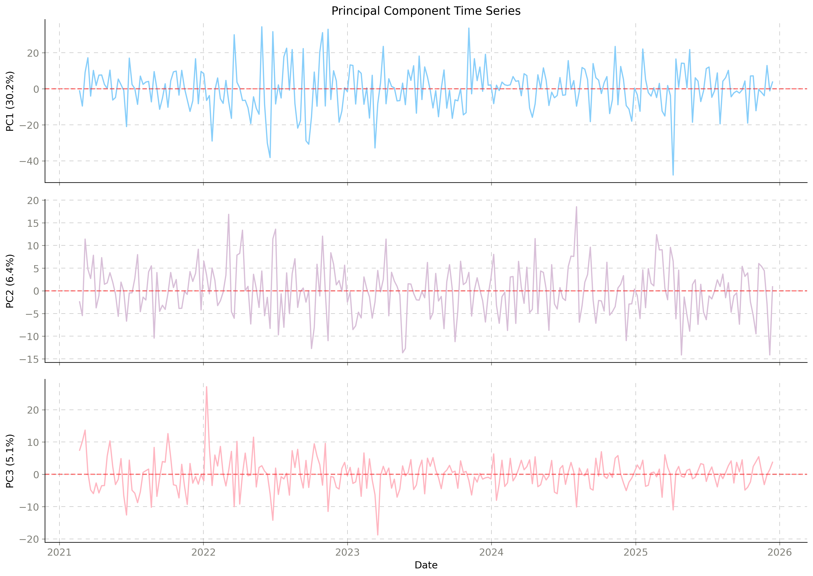

# PCA Portfolio Analysis

This project demonstrates how to apply **Principal Component Analysis (PCA)** to S&P 500 stock returns to extract the main factors driving market movements and reduce dimensionality for portfolio analysis.

---

### Business Value of Findings

**Key Results:**
- **3.4× dimensionality reduction** while retaining 95% of information
- **Three interpretable factors** explain 42% of variance:
  - Market beta (unavoidable systematic risk)
  - Growth/defensive rotation (tactical allocation tool)
  - Energy exposure (commodity hedge)

**Practical Applications:**

1. **Portfolio Construction**
   - Monitor 143 factors instead of 491 stocks
   - Balance exposure to PC1 (market), PC2 (sectors), PC3 (energy)
   - Identify true diversification opportunities

2. **Risk Management**
   - Decompose portfolio risk into interpretable factors
   - Hedge specific exposures (e.g., energy risk via PC3)
   - Quantify unavoidable market risk (PC1)

3. **Machine Learning**
   - Train models on 143 features instead of 491 (71% reduction)
   - Faster computation, reduced overfitting
   - More robust out-of-sample performance

4. **Market Insights**
   - Track PC2 to identify risk-on/risk-off shifts
   - Monitor PC3 for commodity market stress
   - Use PC1 magnitude to gauge market volatility

---

## Table of Contents

- [Dataset](#dataset)
- [What is PCA?](#what-is-pca)
- [Mathematical Foundation](#mathematical-foundation)
- [When to Use PCA](#when-to-use-pca)
- [Project Structure](#project-structure)
- [Key Findings](#key-findings)
- [Evaluating Pairs Trading Strategy](#pairs-trading-strategy)
- [Installation](#installation)
- [Usage](#usage)

---

## Dataset

### Data Source
- **Stock prices:** Yahoo Finance API via `yfinance` library
- **S&P 500 constituents:** Wikipedia ([List of S&P 500 companies](https://en.wikipedia.org/wiki/List_of_S%26P_500_companies))

### Data Specifications
- **Time period:** 5 years (2020-2025)
- **Frequency:** Weekly returns
- **Number of stocks:** 491 S&P 500 companies
- **Number of observations:** 252 trading weeks
- **Date range:** February 21, 2021 to December 14, 2025
- **Data quality:** No missing values
- **Mean weekly return:** 0.26%

----
## Project Structure

```
pca-portfolio-analysis/
├── data/                              # Raw and processed data files
├── notebooks/                         # Jupyter notebooks
│   ├── 01_data_collection.ipynb       # S&P 500 data retrieval
│   ├── 02_exploratory_analysis.ipynb  # EDA and correlation analysis
│   └── 03_pca_analysis.ipynb          # PCA implementation and results
├── results/                           # Output files
│   └── figures/                       # Generated visualizations
├── images/                            # Images for README
├── requirements.txt                   # Python dependencies
├── .gitignore                         # Git ignore rules
└── README.md                          # This file
```

---

## Key Findings

### Return Characteristics

**Weekly Return Statistics (Sample):**
| Stock | Mean | Std Dev | Min | Max |
|-------|------|---------|-----|-----|
| AAPL | 0.37% | 3.74% | -13.55% | 13.33% |
| A | 0.12% | 3.88% | -13.44% | 15.02% |
| ABBV | 0.43% | 3.21% | -17.30% | 10.17% |

### Market Dynamics Over Time



**Key Observations:**
- **Cross-sectional volatility** (purple) remains stable around 3-5%
- **Mean weekly returns** (pink) fluctuate around zero with high amplitude
- **Volatility spikes** visible in early 2022 and late 2025 (macro events)
- **Regime shifts** apparent: 2022 bear market shows increased dispersion
- Market exhibits both systematic movements (mean) and idiosyncratic variation (cross-sectional volatility)

---

### Correlation Structure

The correlation analysis reveals strong co-movement patterns among S&P 500 stocks, validating the application of PCA for dimensionality reduction.

#### Correlation Matrices


*Full correlation matrix showing sector clustering patterns*


*Detailed view: Block-diagonal structure indicates sector groupings*

**Key Insights:**
- **Sector clustering:** Stocks within the same industry show higher correlations (darker blocks)
- **Market co-movement:** Light purple baseline confirms broad systematic risk
- **Diversification opportunities:** Low-correlation pairs (lighter areas) signal hedging potential
- **Risk concentration:** High-correlation clusters highlight vulnerability during market stress

#### Distribution of Pairwise Correlations



**Statistical Summary:**

| Metric | Value | Interpretation |
|--------|-------|----------------|
| **Mean** | 0.284 | Moderate positive correlation indicates systematic market risk |
| **Median** | 0.280 | Close to mean → symmetric distribution |
| **Std Dev** | 0.140 | Sufficient variation for strategic pair selection |
| **Pairs >0.7** | 643 (0.5%) | Very few extreme correlations → diversification is effective |

**Key Takeaways:**
- **Moderate co-movement:** On average, two random stocks move together 28.4%
- **Stable structure:** Standard deviation of 0.14 indicates consistent correlation patterns
- **Normal distribution:** Predictable patterns enable reliable risk modeling
- **Diversification viable:** Only 0.5% of pairs are highly correlated (>0.7)

---

### Why PCA for This Data?

The correlation structure makes PCA particularly effective for this dataset:

**Rationale:**
1. **Dimensionality reduction:** Compress 491 stocks → few principal components while preserving variance
2. **Moderate correlation (0.284):** Indicates co-movement but not redundancy, ideal for PCA
3. **Factor identification:** Extract common drivers (market factor, sector trends) from return patterns
4. **Noise separation:** Distinguish systematic risk factors from stock-specific noise
5. **Computational efficiency:** Enable faster portfolio optimization on reduced feature space
6. **Stable structure:** Consistent correlations (σ=0.14) yield robust principal components

**Expected Outcomes:**
- PC1 will likely capture broad market movements (~30-40% variance)
- Subsequent PCs will represent sector-specific or style factors
- 10-20 components should explain 80%+ of total variance

---


## PCA Results

### Variance Explained

PCA was fitted with 252 components. The analysis reveals a **dominant first component** capturing nearly one-third of total variance, followed by rapidly declining contributions from subsequent components.



**Top 3 Components:**
- **PC1:** 30.24% (market factor)
- **PC2:** 6.39% (sector rotation)  
- **PC3:** 5.13% (energy exposure)

**Key Observations:**
- **Dominant first component:** PC1 explains 30.2% of variance, nearly one-third of all variation
- **Rapid variance decay:** Steep decline after PC1 (30.2% → 6.4% → 5.1%)
- **Top 3 components:** Together explain ~42% of total variance
- **Long tail:** Remaining 249 components account for the other 58%, indicating diverse patterns

---

### Eigenvalue Analysis



**Eigenvalue Statistics:**

| Metric | Value |
|--------|-------|
| **Total eigenvalues** | 252 |
| **Largest (λ₁)** | 149.09 |
| **Smallest (λ₂₅₂)** | ~0 |
| **Max/Min ratio** | 5.07 × 10³³ |

**Top 10 Eigenvalues:**

| Component | Eigenvalue | Variance Explained | Cumulative |
|-----------|------------|-------------------|------------|
| PC1 | 149.09 | 30.24% | 30.24% |
| PC2 | 31.50 | 6.39% | 36.63% |
| PC3 | 25.28 | 5.13% | 41.76% |
| PC4 | 11.95 | 2.42% | 44.19% |
| PC5 | 9.92 | 2.01% | 46.20% |
| PC6 | 9.46 | 1.92% | 48.12% |
| PC7 | 8.21 | 1.67% | 49.78% |
| PC8 | 6.84 | 1.39% | 51.17% |
| PC9 | 6.62 | 1.34% | 52.52% |
| PC10 | 5.59 | 1.13% | 53.65% |

**Key Insights:**
- **Absolute dominance:** PC1's eigenvalue (149.09) is ~5× larger than PC2 (31.50)
- **Extreme ratio:** Max/min ratio indicates near-zero variance in some dimensions (redundant features)
- **Top 10 components:** Collectively explain ~54% of variance
- **Even distribution:** After PC1, relatively consistent decay (1-6% each) suggests multiple independent patterns
- **No clear elbow:** Continuous exponential decline without sudden plateau

**Left panel (linear scale):** Shows absolute dominance of first eigenvalue  
**Right panel (log scale):** Reveals continuous decay pattern across all components

---

### Component Loadings



**Pattern Analysis:**

| Component | Pattern | Interpretation |
|-----------|---------|----------------|
| **PC1** (30.2%) | All positive loadings (~0.03-0.06) | Market factor, all stocks move together |
| **PC2** (6.4%) | Mixed signs with clear extremes | Stock differentiation, contrasts between sectors |
| **PC3** (5.1%) | Sparse with both signs | Independent contrast pattern, industry groups |

**What This Means:**
- **PC1** tells us: "The market went up or down"
- **PC2 & PC3** tell us: "Which stocks outperformed vs. underperformed"
- These contrasts reveal **diversification opportunities** within the market

---

### Factor Interpretation


*Heatmap showing how the 20 stocks with highest PC1 loadings contribute to the first 5 components*

#### PC1: Market Factor (30.24%)

**Top Contributors (All Positive):**

| Stock | Sector | Loading | Interpretation |
|-------|--------|---------|----------------|
| BLK | Financials | 0.0680 | BlackRock (asset management) |
| AMP | Financials | 0.0666 | Ameriprise (wealth management) |
| DOV | Industrials | 0.0663 | Dover Corporation |
| ITW | Industrials | 0.0650 | Illinois Tool Works |
| MCO | Financials | 0.0633 | Moody's (credit ratings) |
| GS | Financials | 0.0633 | Goldman Sachs |

**Least Contributors (Still Positive):**

| Stock | Sector | Loading |
|-------|--------|---------|
| CPB | Consumer Staples | 0.0157 |
| MOH | Healthcare | 0.0156 |
| UNH | Healthcare | 0.0148 |
| DG | Consumer Discretionary | 0.0134 |
| GIS | Consumer Staples | 0.0132 |

**Interpretation:**
- **Systematic market risk** captured by PC1 affects all stocks
- **Cyclical/financial stocks** most sensitive to broad market movements
- **Defensive sectors** (consumer staples, healthcare) least sensitive but still positive
- **Cannot be diversified away** within S&P 500 represents unavoidable market beta

---

#### PC2: Sector Rotation (6.39%)

**Positive Contributors (Utilities):**

| Stock | Loading | Company |
|-------|---------|---------|
| ED | +0.134 | Consolidated Edison |
| DUK | +0.131 | Duke Energy |
| SO | +0.127 | Southern Company |
| WEC | +0.125 | WEC Energy |
| CMS | +0.122 | CMS Energy |

**Negative Contributors (Semiconductors/Tech):**

| Stock | Loading | Company |
|-------|---------|---------|
| LRCX | -0.083 | Lam Research |
| KLAC | -0.081 | KLA Corporation |
| AMAT | -0.080 | Applied Materials |
| NVDA | -0.080 | Nvidia |
| CDNS | -0.079 | Cadence Design |
| CRWD | -0.075 | CrowdStrike |

**Interpretation:**
- **Classic defensive vs. growth rotation**
- **Risk-off periods:** Utilities outperform (positive PC2), semiconductors lag
- **Risk-on periods:** Tech/semiconductors rally (negative PC2), utilities lag
- Represents **investor sentiment shifts** between safety and growth

**Portfolio Strategy:**
- To reduce PC2 exposure: Balance utilities with semiconductors
- To hedge market uncertainty: Use this factor to adjust growth/defensive mix

---

#### PC3: Energy vs. Stable Tech (5.13%)

**Positive Contributors (Energy):**

| Stock | Loading | Company |
|-------|---------|---------|
| XOM | +0.135 | Exxon Mobil |
| COP | +0.133 | ConocoPhillips |
| SLB | +0.130 | Schlumberger |
| DVN | +0.130 | Devon Energy |
| HAL | +0.129 | Halliburton |

**Negative Contributors (Quality Tech/Healthcare):**

| Stock | Loading | Company |
|-------|---------|---------|
| ZTS | -0.092 | Zoetis |
| IDXX | -0.082 | IDEXX Laboratories |
| TYL | -0.080 | Tyler Technologies |
| MSFT | -0.077 | Microsoft |
| ADBE | -0.073 | Adobe |

**Interpretation:**
- **Commodity exposure vs. quality growth**
- Positive side: Oil & gas extraction/services (sensitive to oil prices)
- Negative side: Stable, recurring-revenue business models
- Captures **oil price sensitivity** as distinct risk factor

**Portfolio Strategy:**
- To hedge PC3: Combine energy stocks with stable tech
- Energy moves independently based on commodity prices, not market sentiment

---

### Time Series Analysis



**PC1 (Market Factor - 30.2%):**
- **Major crashes:** Mid-2022 drop (~40), early 2025 crash (~40)
- **Bull period:** Persistent positive territory throughout 2023-2024
- **High volatility:** Multiple swings between -20 and +20
- Captures **broad market rallies and selloffs** magnitude shows movement intensity

**PC2 (Sector Rotation - 6.4%):**
- **Lower volatility** than PC1 (range: -15 to +20)
- **Sharp positive spike** (~+19) in mid-2024 (risk-off, utilities favored)
- **Mean-reverting:** Oscillates around zero
- **Several negative dips** (-10 to -15) during risk-on periods (semiconductors favored)
- Shows **alternating risk regimes**

**PC3 (Energy Factor - 5.1%):**
- **Massive spike** (+30) in early 2022 (oil/energy shock from Russia-Ukraine war)
- **Recent stability** near zero (2024-2025) energy volatility subsided
- **Event-driven:** Responds to geopolitical/commodity shocks

---

### Dimensionality Reduction Summary

**Optimal Configuration (95% Variance Threshold):**

```
Original dimensions:    491 stocks
Reduced dimensions:     143 components
Dimensionality reduction: 70.9%
Variance retained:      95.01%
```

**Alternative Configurations:**

| Variance Target | Components Required | Reduction |
|----------------|---------------------|-----------|
| 90% | 105 | 78.6% |
| 95% | 143 | 70.9% |
| 99% | 201 | 59.1% |

**Top 10 Component Breakdown:**

| PC | Individual | Cumulative |
|----|-----------|------------|
| 1 | 30.24% | 30.24% |
| 2 | 6.39% | 36.63% |
| 3 | 5.13% | 41.76% |
| 4 | 2.42% | 44.19% |
| 5 | 2.01% | 46.20% |
| 6 | 1.92% | 48.12% |
| 7 | 1.67% | 49.78% |
| 8 | 1.39% | 51.17% |
| 9 | 1.34% | 52.52% |
| 10 | 1.13% | 53.65% |

---


## Pairs Trading Strategy

A statistical arbitrage pipeline built on top of the PCA loadings, selecting and trading mean-reverting stock pairs. This pipeline constitutes an **exploratory, in-sample signal study** a first step before rigorous out-of-sample validation.

### Pipeline Overview

PCA Loadings
↓
Loading Distance → Top 300 Pair Candidates
↓
Sector Filter → 86 Same-Sector Pairs
↓
Engle-Granger Cointegration Test (p < 0.05)
↓
2 Cointegrated Pairs (in-sample)
↓
Spread & Z-Score → Signals → Walk-Forward Backtest

### Pair Candidate Selection

- Stocks projected into 2D factor space (PC1 & PC2).
- Pairwise Euclidean distances computed across all 480 stocks.
- Top 300 closest pairs retained as candidates, small distance = shared dominant risk factors.
- Cross-sector pairs dropped (PCA distance is sector-agnostic; cross-sector cointegration is likely spurious).
- Result: **86 same-sector pairs** for cointegration testing.

### Cointegration Testing (In-Sample)

- Daily prices resampled to weekly; log-transformed for spread stationarity.
- Engle-Granger test applied to all 86 pairs (minimum 60 weeks of shared history required).
- Significance threshold: p < 0.05. Note: 86 simultaneous tests at α = 0.05 imply ~4 expected false positives under the full null, results should be interpreted accordingly.
- Result: **2 cointegrated pairs.**

| Pair | Sector | p-value |
|------|--------|---------|
| EXPD / J | Industrials | 0.0175 |
| KHC / KR | Consumer Staples | 0.0367 |

KHC/KR is economically intuitive (shared food-price factor exposure). EXPD/J plausible via shared rate sensitivity.

### Spread & Signal Construction

- **Hedge ratio** estimated via OLS regression of log(A) on log(B).
- **Spread** = log(A) − β · log(B)
- **Z-score** computed on a rolling 52-week window.

| Condition | Action | Signal |
|-----------|--------|--------|
| z > +2.0 | Short spread (short A, long B) | −1 |
| z < −2.0 | Long spread (long A, short B) | +1 |
| \|z\| < 0.5 | Close position | 0 |

Positions held via forward-fill until exit threshold is crossed.

| Pair | Time in Position |
|------|-----------------|
| KHC / KR | 20.7% |
| EXPD / J | 38.4% |

KHC/KR falls within the target range of 15–30% for z-entry = 2.0. EXPD/J is elevated, suggesting noisier mean-reversion.

### Walk-Forward Backtest (Out-of-Sample)

Pipeline refitted independently on each 2-year training window; signals evaluated on a strictly unseen 1-year test window. Pair selection and cointegration testing are repeated per window, no information from the in-sample study carries over.

| Window | Pairs | Portfolio PnL | Sharpe |
|--------|-------|--------------|--------|
| 2023-02 | 20 | −$470 | −0.11 |
| 2023-08 | 21 | −$11,795 | −2.15 |
| 2024-02 | 30 | +$6,143 | +1.18 |
| 2024-08 | 28 | −$270 | −0.04 |

**Aggregate (4 windows, $10k/pair):**

| Metric | Value |
|--------|-------|
| Total PnL | −$6,391 |
| Annualised Return | −0.64% |
| Sharpe Ratio | −0.29 |
| Max Drawdown | −$10,362 |

### Findings & Next Steps

OOS performance is negative across all windows, consistent with a momentum-dominated regime (2023–2025) structurally unfavorable to mean-reversion strategies. The single profitable window (2024-02) coincides with a brief period of elevated cross-sectional dispersion, confirming regime dependency rather than strategy edge.

This is a known limitation of static pairs trading frameworks and motivates the following extensions, addressed in a subsequent project:

- **Dynamic hedge ratios** via Kalman Filter, OLS beta is fixed at training time; Kalman tracks the relationship continuously
- **Regime detection** via Hidden Markov Model, condition pair selection and execution on mean-reversion vs. momentum regimes
- **ML-based spread prediction** via LSTM or Transformer, replace static z-score thresholds with learned entry/exit signals
- **Higher frequency execution**, weekly rebalancing is too slow; mean-reversion signal decay occurs within days, not weeks

---

## Installation

```bash
# Clone the repository
git clone https://github.com/yourusername/pca-portfolio-analysis.git
cd pca-portfolio-analysis

# Create conda environment from environment.yml
conda env create -f environment.yml

# Activate the environment
conda activate ds_env

# (Optional) Register the environment as a Jupyter kernel
python -m ipykernel install --user --name ds_env --display-name "Python (ds_env)"

```

---

## Usage

Run the Jupyter notebooks in order:

```bash
jupyter notebook
```

1. **01_data_collection.ipynb** - Download S&P 500 stock data
2. **02_exploratory_analysis.ipynb** - Explore returns and correlations
3. **03_pca_analysis.ipynb** - Apply PCA and interpret results


---
## Additional
---

## What is PCA?

Principal Component Analysis (PCA) constructs a **new basis of a vector space** consisting of **linearly independent, orthogonal vectors**, such that with as few basis vectors as possible, the **maximum variance (information) of the data** is preserved.

- **Original basis:** The original variables (stock returns)
- **New basis:** Principal components (eigenvectors)

---

## Mathematical Foundation

### Conceptual Pipeline

```
Raw Data 
  ↓
Covariance Matrix 
  ↓
Eigenvalue Decomposition 
  ↓
Principal Components (ranked by explained variance)
  ↓
Dimensionality Reduction
```

### Geometric Interpretation

**1. Original Data Space**
- 491-dimensional space (one dimension per stock)
- Each trading day = one point in this high-dimensional space
- 252 points scattered in 491 dimensions

**2. Covariance Matrix**
- Size: 491 × 491
- Measures how each pair of stocks co-varies
- Properties: Symmetric, positive semi-definite
- Diagonal: Individual stock variances | Off-diagonal: Pairwise covariances

**3. Eigenvalue Decomposition**
- **Eigenvalues:** Amount of variance captured in each direction
- **Eigenvectors:** Directions of maximum variance
- Sorted by eigenvalue magnitude (largest first)
- Largest eigenvalue → PC1 (most important direction, typically market factor)

**4. Principal Components**
- New coordinate system aligned with variance structure
- **PC1:** Direction of maximum variance (market factor)
- **PC2:** Second most variance (orthogonal to PC1)
- **PC3, PC4, ...:** Progressively less variance, all mutually orthogonal

**5. Dimensionality Reduction**
- Retain only top K components
- Discard components with small eigenvalues (noise)
- Result: 491 dimensions → K dimensions
- Trade-off: Simplicity vs. information preservation

**6. Orthogonality Property**
- All principal components are uncorrelated by construction
- Eigenvectors are mathematically orthogonal
- Result: Independent risk factors for portfolio analysis

---

## When to Use PCA

### PCA Works Well When:
- Strong correlations exist between variables
- Variance is concentrated in a few directions
- Data has underlying linear structure

### PCA Works Poorly When:
- All variables are equally important
- No clear correlation structure exists
- Information exists in non-linear relationships
- Data is sparse or has many zeros

---

## Contact

https://www.linkedin.com/in/nl-data